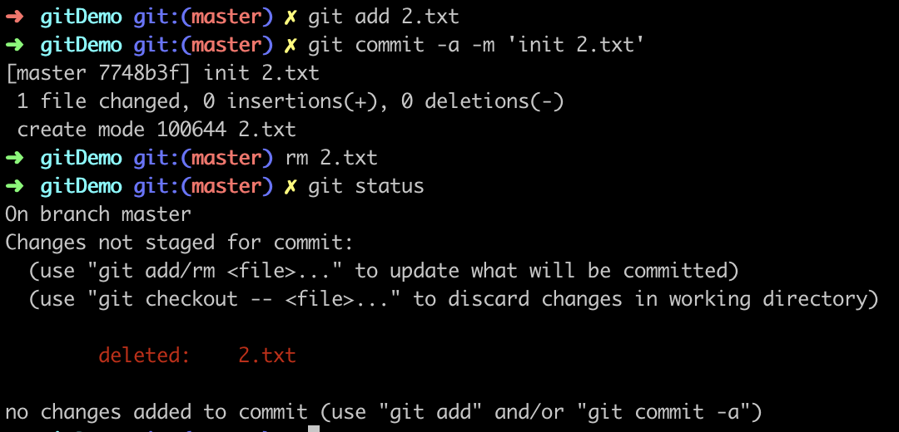
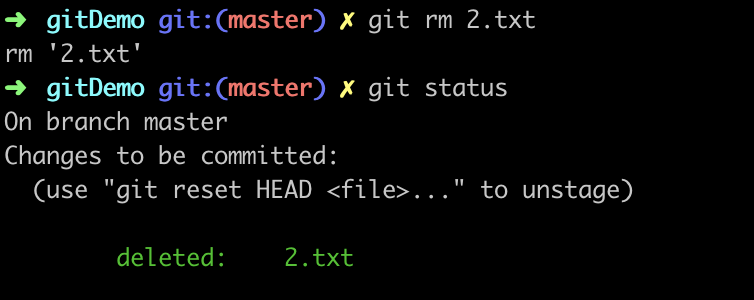

### git教程二：删除项目
#### 1.删除文件
```Shell
$ touch 2.txt // 新建文件
$ git add 2.txt
$ git commit -m 'init 2.txt'
$ rm 2.txt // 删除文件
$ git status // 查看文件当前状态
```
文件状态如下

此时工作区没有2.txt文件，版本库有2.txt文件。
（1）从版本库删除2.txt文件
```Shell
$ git rm 2.txt
$ git commit -m 'remove 2.txt'
```
文件状态如下


（2）恢复删错的2.txt文件
```Shell
$ git checkout -- 2.txt
```
恢复的是最新一次提交的文件
