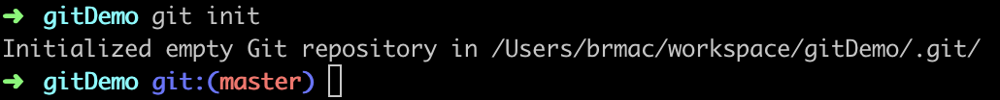
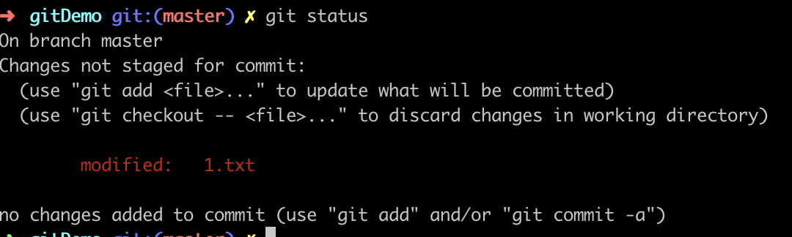
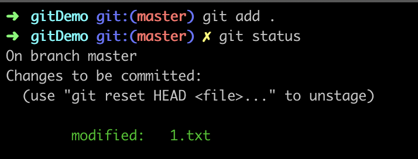
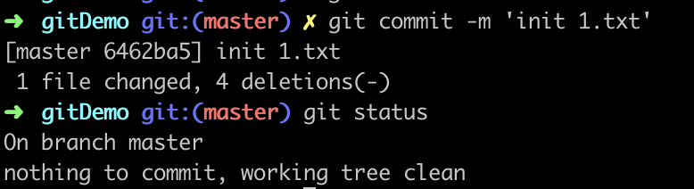
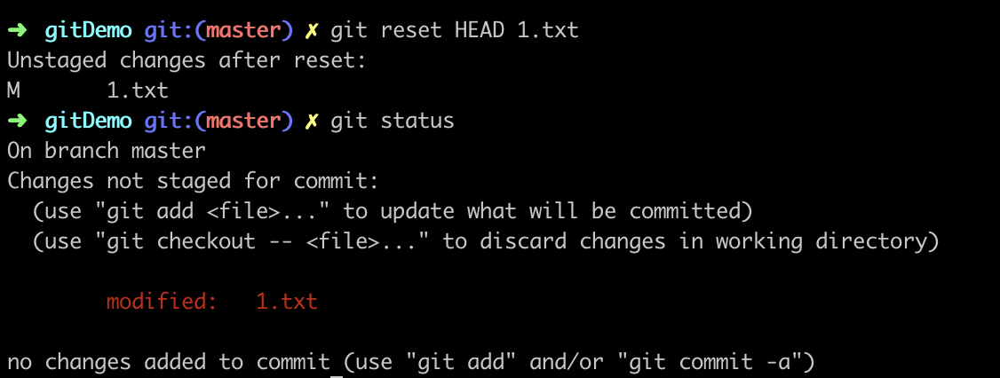
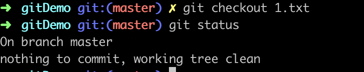
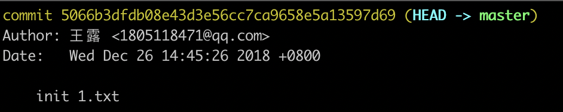

### git教程一：新建git以及提交
#### 创建一个git项目
```Shell
$ mkdir gitDemo
$ cd gitDemo
$ git init
```
会在gitDemo下创建一个.git文件，

#### 添加文件并推文件到仓库
首先，我们要明白git是有三个区，分别为工作区，暂存区和版本
```Shell
$ touch 1.txt
```
添加内容`this is 1`，此时1.txt还在我们本地，这个区我们称为工作区

git status是查看文件状态的，1.txt变成红色


接下来提交到暂存区
```Shell
$ git add 1.txt
$ git status
```
1.txt变成绿色，表示


接下来提交到版本
```Shell
$ git commit -m 'init 1.txt'
$ git status
```


逆向操作，从版本到暂存区，使用
```Shell
$ git reset HEAD 1.txt
$ git status
```
1.txt变成红色,表示回到工作区

从工作区撤销更改，使用
```Shell
$ git checkout 1.txt
$ git status
```

我们发现1.txt中增加的2已经没有了，回到了第一次提交的状态

版本是什么状态呢？执行git log如下

5066b3dfdb08e43d3e56cc7ca9658e5a13597d69就是版本号
版本是.git文件，不要修改这个文件。
(HEAD -> master)HEAD是指针，指向master，master是git为我们创建的分支。
我们提交到版本，还没有推到远程。但是我们发现自己提交了一条错误的修改到版本，必须撤销这次修改，
使用`git reset --hard HEAD^`表示回到前一次提交
使用`git reset --hard xxx`表示回到版本号为xxx的这次提交
执行git log发现日志最新的就是xxx这次版本的提交。

git diff可以用来帮我们看修改内容

tips：如果一个文件不是第一次add，可以使用`git commit -a -m 'add 3 to 1.txt'`，将add 和commit命令合并，直接将文件提交到版本

思考：为什么我们需要三个区，为什么不能直接从工作区到版本。
我们可以将工作区理解成本地开发环境，暂存区是测试环境，版本是生产环境，有些文件只想在本地并不想直接发生产，所以我们可以将需要提交的文件放到测试环境，测试成功后将代码放在生产环境。一句话总结：工作区可以随便修改，暂存区放我们只想提交到版本的文件。

不想提交到git的文件还可以使用.gitignore文件。

如果我们一不小心commit的时候提交的文案写错了，我们可以执行`git commit --amend`修改
