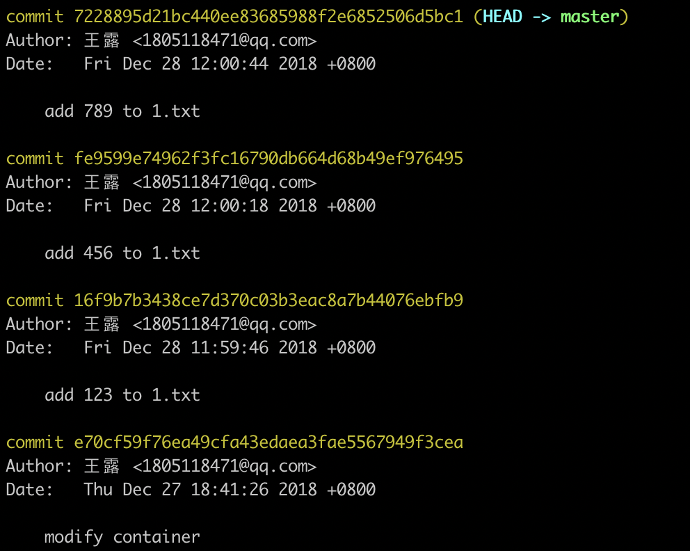
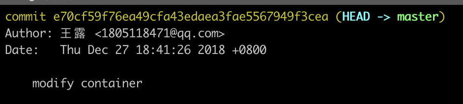
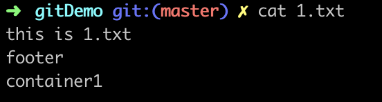
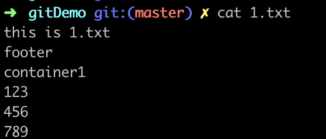

### git教程四：hard 和 soft
我们对一个文件做了多次修改，并每次都提交，但是这些都是同类功能，所以我们打算将多次提交合并，我们可以使用
```Shell
$ git reset --hard xxx
$ git reset --soft xxx
```
xxx表示版本号，这两个命令的区别如下
#### hard
我们对1.txt文件做了3次修改，每次增加的内容分别是123，456，789，提交之后log如下

然后我们执行`git reset --hard xxx`后，log如下

文件内容如下，修改的内容没有了



#### soft
我们对1.txt文件做了3次修改，每次增加的内容分别是123，456，789，提交之后log如下

然后我们执行`git reset --soft xxx`后，log如下
没有add 123，456，789三次的提交了

文件内容如下，三次增加的修改还在文件中


执行`git commit -m 'add 123456789 to 1.txt'`现在只有一条提交记录


#### 总结
- 相同点：都可以回退版本

- 不同点：hard不会保留修改记录，soft会保留修改记录
- 适用场景：

  hard适合于舍弃已经开发并提交到版本的功能，就像时间线回到add 123之前；

  soft适合多次提交的都是同类型的操作
