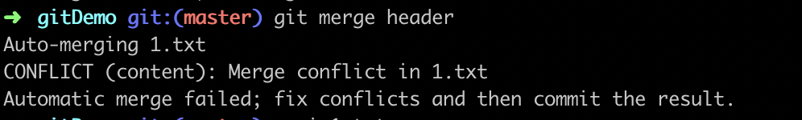
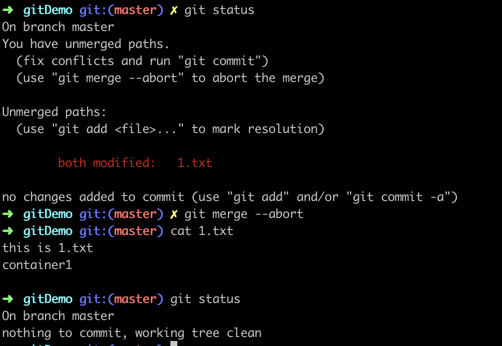
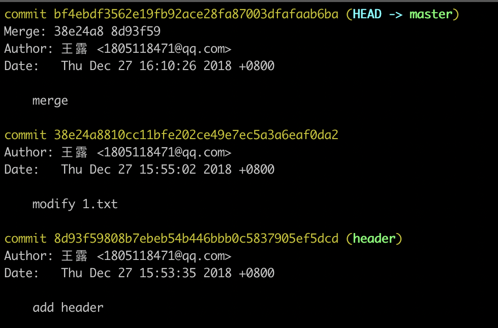
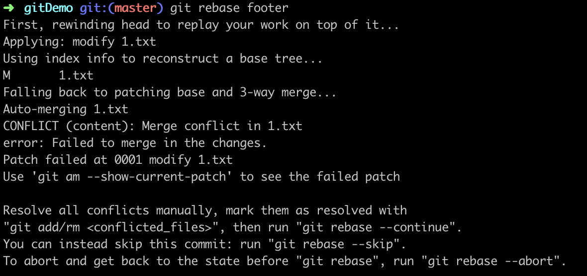
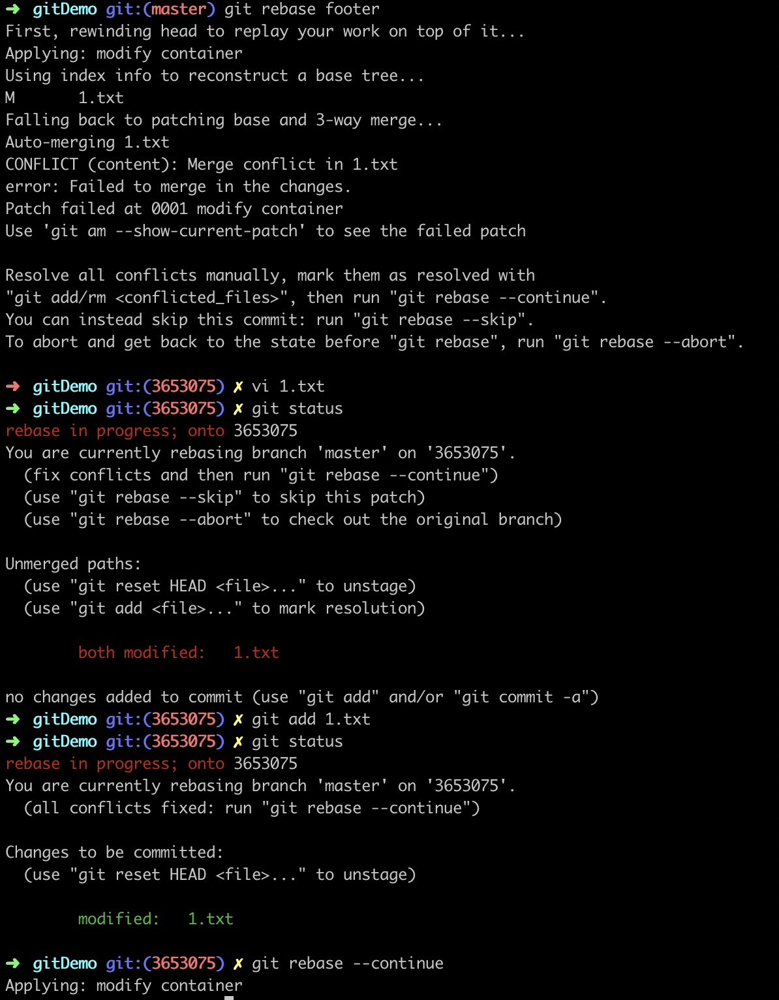
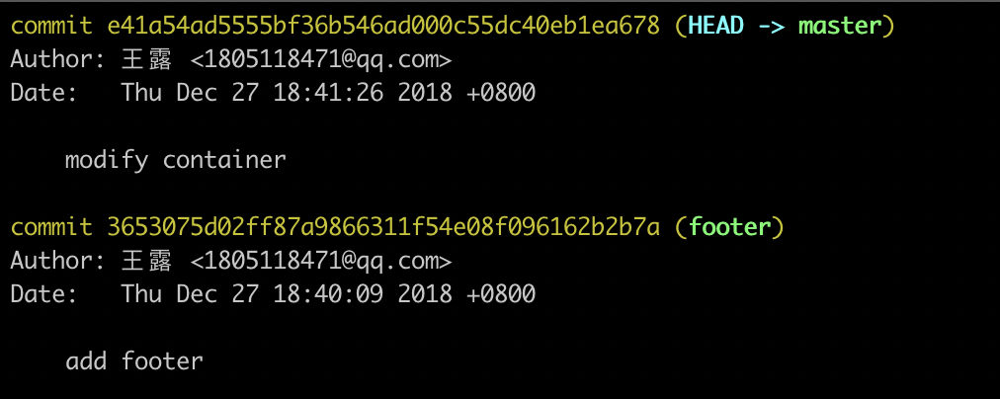
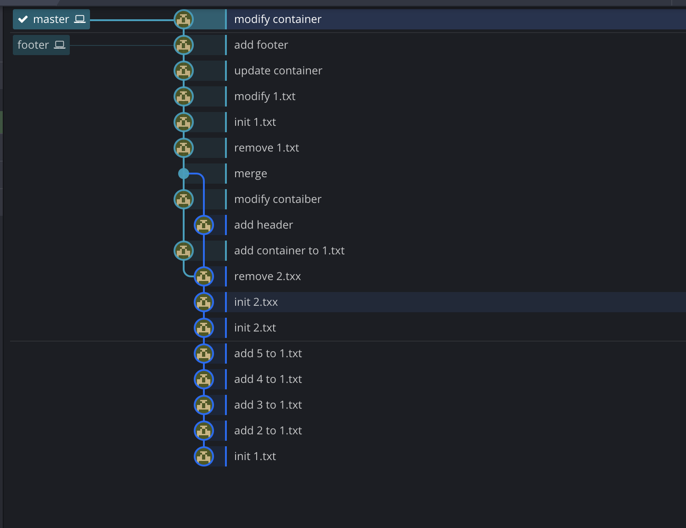
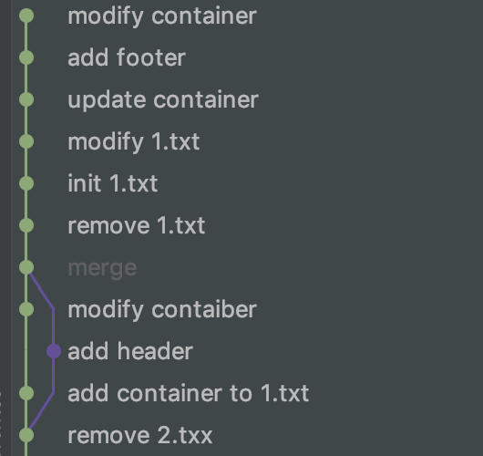

### git教程三：合并分支的两种方式
实际开发中我们可能是多人协作，每个人都在自己的分支上开发，最后合并到master分支，合并分支有下面2种方式：merge和rebase
新建一个文件为1.txt，内容为
```Shell
this is 1.txt
container
```
#### git merge
创建一个新的分支为header，修改1.txt为
```Shell
this is 1.txt
container
header
```
然后执行下面的命令
```Shell
$ git add 1.txt
$ git commit -m 'add header'
$ git checkout master // 切到master分支
```
修改1.txt内容
```Shell
this is 1.txt
container1
```
```Shell
$ git add 1.txt
$ git commit -m 'modify 1.txt'
$ git merge header // 合并分支header到master
```

这个告诉我们1.txt文件有冲突，我们需要手动解决冲突
然后执行git status，提示如下：
有两种选择：
（1）`git merge --abort`
（2）`git commit`

我们可以执行`git merge --abort`放弃这次合并，也可以执行commit提交这次merge
合并完成

执行`git log`，我们可以看见header分支存在的记录以及合并记录

最后我们删除这个header分支：`git branch -D header`

#### git rebase
创建一个新的分支为footer，前面的步骤和merge一样
合并的时候用`git rebase header`，结果如下

`git rebase --skip`: 舍弃master分支更改，合并后的内容和footer分支完全一样
`git rebase --abort`: 舍弃footer分支更改，合并后的内容和master分支完全一样

我们手动解决冲突，解决之后使用`git add 1.txt`提交修改到暂存区，然后执行`git rebase --continue`

此时合并完成
执行`git log`如下


#### 添加--no-ff参数
两个命令后面添加`--no-ff`参数，表示不合并快照（Fast forward）

#### merge vs rebase
#####1. 步骤：
  merge 需要3步：add header，modify 1.txt， merge
  rebase需要2步：add footer, modify 1.txt
#####2. 执行git命令
  merge 需要git add , git commit
  rebase需要git add , git rebase --continue
#####3. 适用场景
merge会保留合并记录，会切一个分支出来，适用于功能性需求
rabase不会保留合并记录，看起来像是在master分支上继续开发一样，适用于fix bug



总结：
查看所有分支：`git branch --all / git branch`
新建xxx分支：`git branch xxx`
切换xxx分支：`git checkout xxx`
新建并切换xxx分支(上面两个命令合并)：`git checkout -b xxx`
删除xxx分支：`git branch -D xxx`，若要删除xxx分支，必须先切换到其他分支才可以删除
`git merge`会保留merge记录以及新建的分支，适用于功能性修改
查看分支合并图：`git log --graph`
