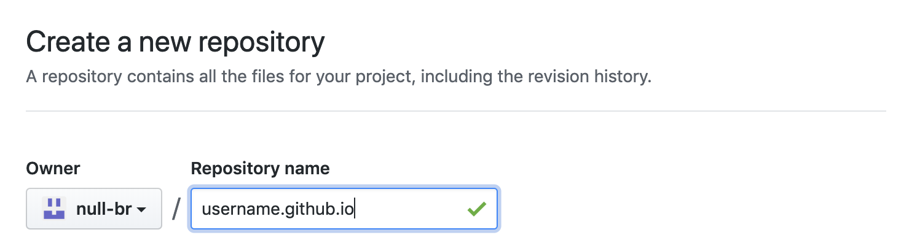
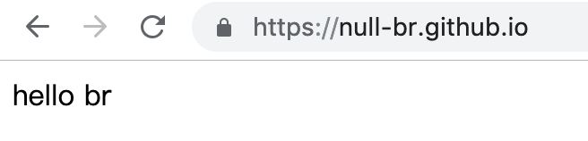
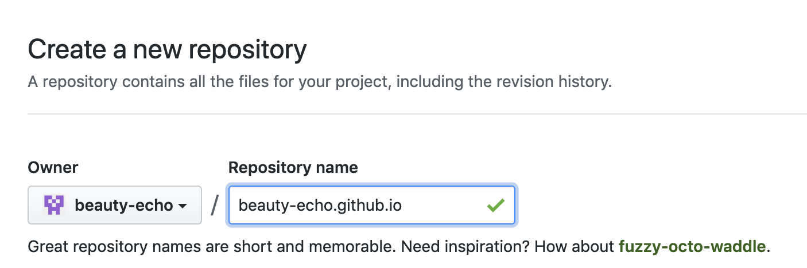
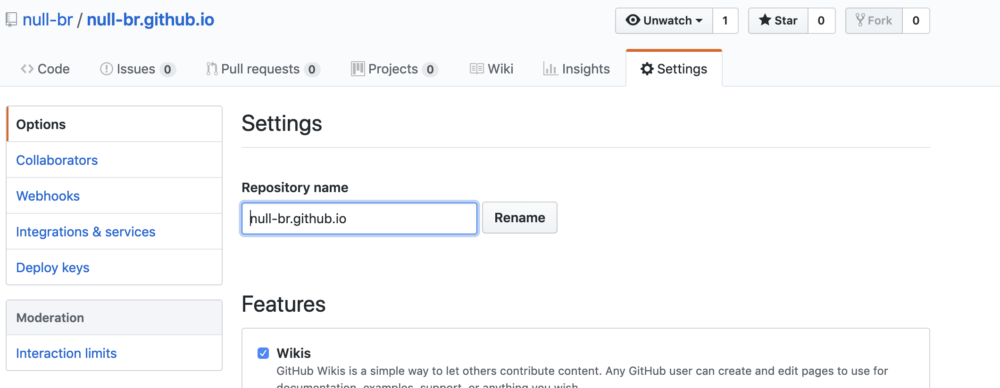
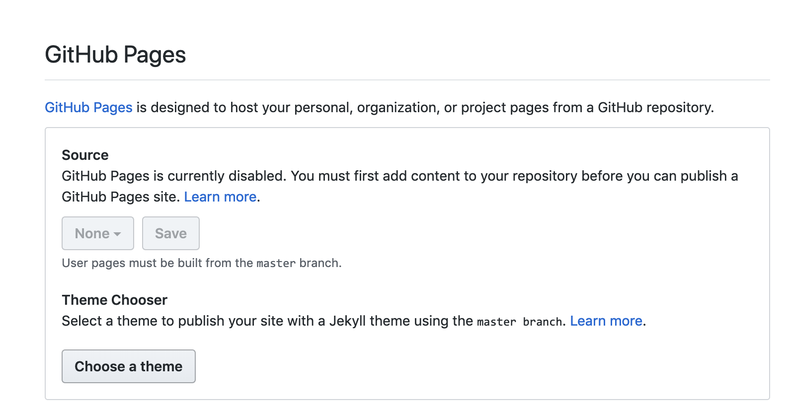
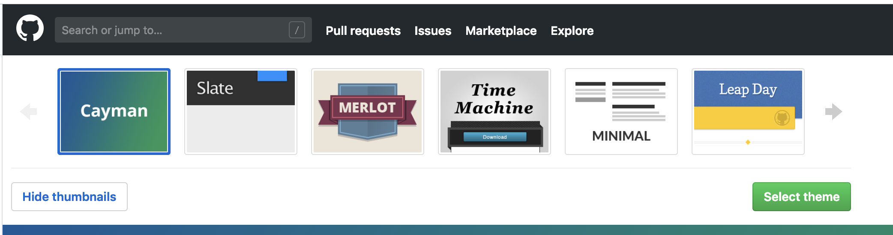

### git教程六：在github上创建一个页面
[官方文档](https://pages.github.com/)
创建的页面URL和https://vmo-fed.github.io/类似，github.io结尾表示我们的页面是托管在github上的。
#### 创建方式有2类
1. 直接在用户名下创建或者创建一个组织然后在组织里创建站点
2.

#### 创建站点
- 直接在用户名下创建
  1. 打开https://github.com/new新建一个仓库，Repository name写你github的名字
  
  2. 在命令行执行
  ```Shell
    $ git clone https://github.com/username/username.github.io
    $ vi index.html
    $ git add index.html
    $ git commit -m 'add index.html'
    $ git push
  ```
  我们给index.html里添加内容`hello br`，访问https://username.github.io结果如下
  
- 在组织下创建站点
 1. 访问[创建组织链接](https://github.com/account/organizations/new)
 2. 创建组织名
 

#### 给已有的项目创建博客页面
  - username文件添加博客页面
    1. 点击setting
    
    2. 点击pages theme
    
    3. 选择主题，然后生成[tooken](https://github.com/settings/tokens)
    
    4. 创建一个文件夹react，在里面新建index.md，然后提交
    5. 访问https://xxx.github.io/react
  - 已经存在的项目添加博客页面
  1. 已有仓库点击新建
  
  2. 创建index.html
