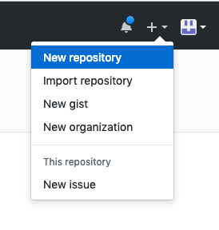
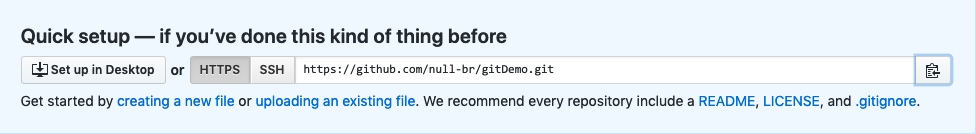

### git教程五： push代码
我们前四节的操作都是在本地电脑，如果我们需要其他人看见我们的代码，需要一个远程仓库，这里我们用github，我们在它上面创建一个项目，叫做gitDemo，我们发现URL有两种形式：https和ssh形式



一：使用http
#### 关联本地项目和远程仓库
1. `git remote add origin https://github.com/null-br/gitDemo.git`
2. 输入username
3. 输入password
4. `git push --set-upstream origin master`(首次提交需要用这个命令，以后提交可以直接`git push`)

#### 从远程仓库拉代码到本地
1. `git clone https://github.com/null-br/gitDemo.git`
2. 输入username
3. 输入password

二：使用ssh
#### 关联本地项目和远程仓库
1. `git remote add origin git@github.com:null-br/gitDemo.git`
2. `git push --set-upstream origin master`(首次提交需要用这个命令，以后提交可以直接`git push`)
使用ssh要先配ssh key，ssh key相当于一个凭证，告诉github你的身份。从而不用每次都输入账户和密码[ssh参考资料](https://help.github.com/articles/connecting-to-github-with-ssh/)
3. 生成ssh key：
```Shell
$ ssh-keygen -t rsa -b 4096 -C "your_email@example.com"
```
然后一路回车
4. 查看ssh key
```Shell
$ cat ~/.ssh/id_rsa.pub
```
5. 添加这个公钥到github
点击https://github.com/settings/keys

完成～

#### 克隆远程仓库拉代码到本地
1. `git clone git@github.com:null-br/gitDemo.git`


ps：`git remote -v`查看远程git仓库的信息
