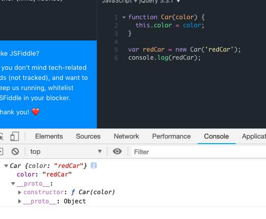
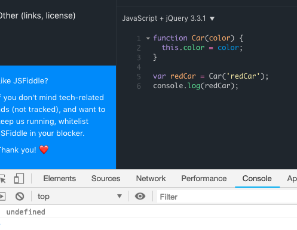
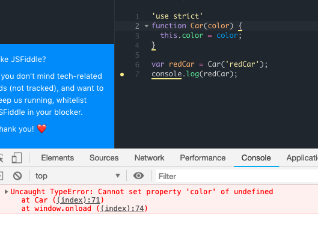

#### contructor

构造函数和普通函数写法一样，只是我们习惯将构造函数大写。

```javascript
function Car(color) {
  this.color = color;
}

var redCar = new Car('redCar');
console.log(redCar);

// result
Car {color: "redCar"}
  color: "redCar"
  __proto__: // 是redCar的creator
    constructor: ƒ Car(color) // constructor是creator的一部分
    __proto__: Object
```

调用new的时候，设置contructor(Car)的内部属性（color），引用creator。
如果我们不用new，结果是undefined，因为Car没有返回任何结果。这样我们创建的属性就会挂在window下，在最开始加上'use strict'可以避免这种问题，此时this不是window对象，会报错



js中是没有私有属性的概念，我们可以通过闭包创建私有属性。
何为闭包？
在一个函数中可以访问另外一个函数中的变量，这个函数就是闭包，一个最简单的闭包如下
```javascript
()()
```
```javascript
function Car() {
  var _color = 'red';
  this.getColor = function() {
  	return _color
  }

}

var redCar = new Car('redCar');
console.log(redCar._color); // undefined， 访问不到私有属性
console.log(redCar.getColor());// red
```
