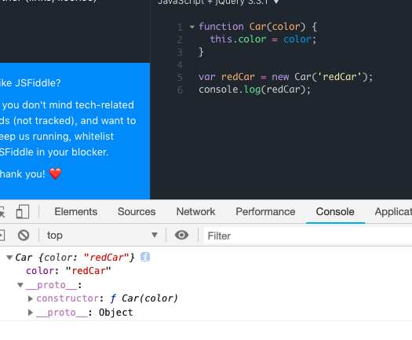
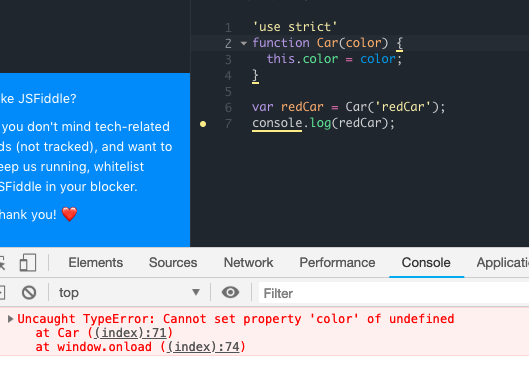
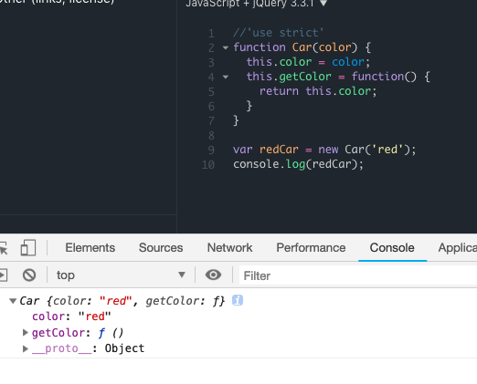
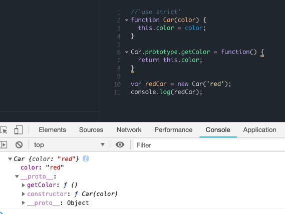
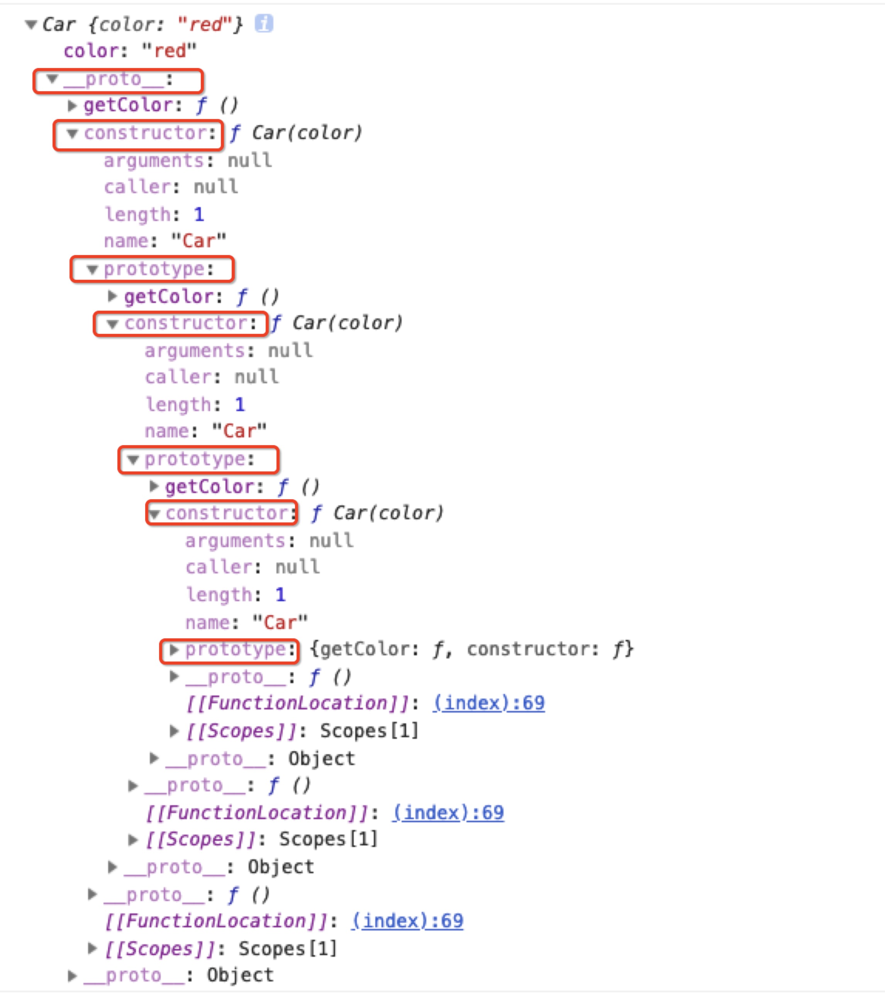
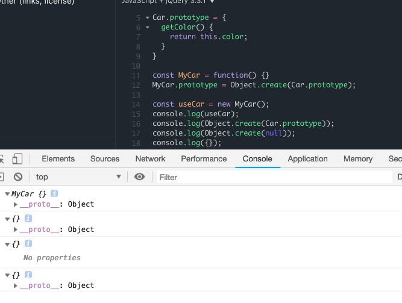
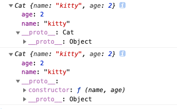

#### contructor

构造函数和普通函数写法一样，只是我们习惯将构造函数大写。

```javascript
function Car(color) {
  this.color = color;
}

var redCar = new Car('redCar');
console.log(redCar);

// result
Car {color: "redCar"}
  color: "redCar"
  __proto__: // 是redCar的creator
    constructor: ƒ Car(color) // constructor是creator的一部分
    __proto__: Object
```
__proto__相当于prototype

调用new的时候，设置contructor(Car)的内部属性（color），引用creator。
如果我们不用new，结果是undefined，因为Car没有返回任何结果。这样我们创建的属性就会挂在window下，在最开始加上'use strict'可以避免这种问题，此时this不是window对象，会报错



js中是没有私有属性的概念，我们可以通过闭包创建私有属性。
何为闭包？
在一个函数中可以访问另外一个函数中的变量，这个函数就是闭包，一个最简单的闭包如下
```javascript
()()
```
```javascript
function Car() {
  var _color = 'red';
  this.getColor = function() {
  	return _color
  }

}

var redCar = new Car('redCar');
console.log(redCar._color); // undefined， 访问不到私有属性
console.log(redCar.getColor());// red
```

#### prototype
每个contructor都有一个prototype
```javascript
function Car(color) {
  this.color = color;
  this.getColor = function() {
    return this.color;
  }
}

var redCar = new Car('red');
console.log(redCar);
```

将getColor方法添加在prototype上
```javascript
function Car(color) {
  this.color = color;
}

Car.prototype.getColor = function() {
  return this.color;
}

var redCar = new Car('red');
console.log(redCar);
```


上图中我们的getColor方法在__proto__下，我们可以这么理解：
redCar下的__proto__和prototype是一样的，但是因为实例下（new出来的函数）只有__proto__属性，而构造函数的属性为prototype，我们可以测试一下`redCar.__proto__===redCar.constructor.prototype`返回结果为true
我们对上图__proto__下的constructor展开，发现包含prototype，继续展开发现包含constructor


这里_proto__下的constructor就是我们的构造函数，构造函数下有prototype，一直循环往复，就产生了上面的嵌套。那么原型，构造函数，和实例的关系如何？
  1. 每个构造函数都有一个prototype属性，指向实例的_proto__属性
  2. 每个实例都有一个constructor属性，指向构造函数


#### Object.create
这个方法是创建一个新对象，使用现有的对象来提供新创建的对象的__proto__.有2个参数（prototypeObj, propertyObj）
```javascript
const Car = function(color) {
	this.color = color;
}

Car.prototype = {
	getColor() {
  	return this.color;
  }
}

const MyCar = function() {}
MyCar.prototype = Object.create(Car.prototype);

const useCar = new MyCar();
console.log(useCar instanceof MyCar);
console.log(useCar instanceof Car);
```



#### 原型链
```javascript
const Car = function() {}
Car.prototype.print = function() {
  console.log('This is Car');
}

const MyCar = function() {}
MyCar.prototype = Object.create(Car.prototype);
MyCar.prototype.print = function() {
  console.log('This is MyCar');
}

const UseCar = function() {}
UseCar.prototype = Object.create(MyCar.prototype);
UseCar.prototype.print = function() {
  console.log('This is UseCar');
}

const useCar = New UseCar();
console.log(useCar.print());
```
useCar对象会沿着UseCar，UseCar的prototype， MyCar的prototype，Car的prototype属性一直往上找print方法，直到找到为止。

#### 扩展构造函数
```javascript
function Anaimal(name) {
	this.name = name;
}

Anaimal.prototype = {
	eat() {
  	return this.name + 'is eating';
  },
  sleep() {
  	return this.name + 'is sleep';
  }
}

let Cat = function(name, age) {
	Anaimal.call(this, name);
  this.age = age;
}

Cat.prototype = Object.create(Cat.prototype); // Object.create重写__proto__
Cat.prototype.contructor = Cat;// 显示指定contructor
const cat = new Cat('kitty', 2);

console.log(cat);
```
分别是使用Object.create和没有使用Object.create的结果，可以看出第一个__proto__下没有，所以需要`Cat.prototype.contructor = Cat;`


#### setPrototypeOf
setPrototypeOf方法设置一个指定的对象的原型 ( 即, 内部[[Prototype]]属性）到另一个对象或  null
  ```javascript
  let obj1 = {
	eat() {
  	return 'obj1 eat';
  }
}

let obj2 = {
 sleep() {
  	return 'obj2 sleep';
  }
}

Object.setPrototypeOf(obj2, obj1);
console.log(obj2);
```

#### Mixins
接收一个object作为参数，调用其他对象的方法，返回新的对象
```javascript
  const car = function(obj) {
    let moving = false;
    return Object.assign({}, obj, {
      move() {
        isMoving = true;
      },
      isMoving() {
        return isMoving;
      }
    });
  }
  const superCar = function(obj) {
    let fly = false;
    return Object.assign({}, obj, {
      move() {
        isFly = true;
      },
      isFly() {
        return isFly;
      }
    });
  }
  console.log(superCar(car({})));
```
#### static methods
static methods和common methods的区别
```javascript
class Car {
  contructor(color, price) {
    return Object.assign({}, {color, price});
  }
  static comparePrice(car1, car2) {
    console.log(car1.price - car2.price);
  }
}

```
```javascript
  class Car {
    contructor(price) {
      this.price = price;
    }
    static sellCar(car) {
      return `selling for ${this.price}`;
    }
  }

  class BYD extends Car {
    constructor(price) {
      super(price);
    }
    static buyCar(car) {
      return `BYD ${super.sellCar(car)}`;
    }
  }
```
