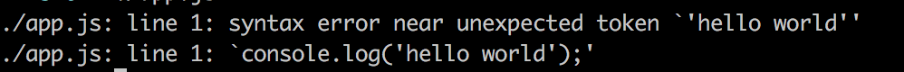

# 局部包和全局包的区别

* 如果你希望使用require时请用局部包
* 如果你希望在命令行去运行的话请使用全局包

> 来自[What is the difference between local and global module in Node.js? When to use local and global module?](https://stackoverflow.com/questions/29530459/what-is-the-difference-between-local-and-global-module-in-node-js-when-to-use-l)

先看一个shell的例子，创建一个名为hello的文件内容如下

```shell
#!/bin/bash
echo hello world
```

\#!指定了程序是用哪个解释器来执行的，这里是bash，所以这里我们可以直接执行它

```shell
chmod 777 ./hello
./hello # hello world
```

> 当然你发现删除!/bin/bash后，./hello依然可以打印出hello world，那是因为它默认是bash

回到nodejs，创建一个名为app.js的文件，内容如下：

```shell
console.log('hello world');
```

直接使用node来运行

```shell
node app.js # hello world
```

这些看起来都很熟悉，那我们改下头部内容，将which node的内容粘贴进去，前面记得加上#!

```shell
#!/usr/local/bin/node
console.log('hello world');
```

此时可以和上面shell一样的做法来run起来

```shell
chmod ./app.js
./app.js # hello world
```

> 你也可以把app.js改为app然后./app运行看是否达到预期的结果？

当我们删除首行的!/usr/local/bin/node，再次执行./app.js会提示



这是因为没有指定需要node的解释器来执行，shell只能用默认的bash来执行它，当然会报错了

我们将包含有#!的app.js拷贝到/usr/local/bin下面

```shell
# 在任何目录下执行下面代码
app.js # hello world
```

由此来看在node中，全局安装的包其实就是在头部指定了是node环境，然后把它copy到了/usr/local/bin下，这样我们就可以使用命令行在任何目录下去执行它了。

而局部包是我们希望引入到js工程中去的（require），所以头部无需指定node环境。

当然我们也可以全局包安装到某个工程里（如果全局和本地工程适用此npm 包的版本不用），然后在npm script中去使用，由于npm script中是会先从工程的node_module去找对应的包，所以npm run xxx是指定的局部包的版本，而不是全局。