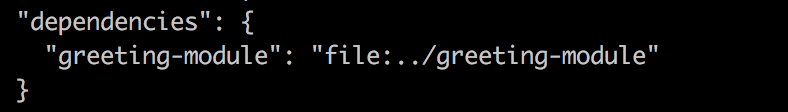

# 快速使用本地的node module

在之前的文章中有讲过[如何写一个npm module](/node/how-to-write-a-npm-module/)，我们需要账号然后发布到npm上，如果我们仅仅需要使用本地的node module直接进行开发改如何做呢？这里有两种方案：

> 为了方便我们已经在[github](https://github.com/vmo-fed/practice.git)上写了些简单的代码，clone下来并进入到npm-link工程

### 方法一：npm install /path

进入到myApp目录

```shell
npm init -y
npm install ../greeting-module -S
```

一切顺利的话你可以在package.json中看到



在shell中执行

```shell
node app.js # hello world
```

此时你修改下greeting-module中的hello.js

```javascript
module.exports = function(name){
  return 'hi ' + name;
}
```

再次运行node app.js你会得到hi world。

当然你想删除此node module的话用法和删除npm包一样

```shell
npm uninstall ../greeting-module
```

### 方法二：npm link

进入到greeting-module目录

```shell
npm link
```

在log中会提示node_modules全局包生成了greeting-module，并指向了当前的这个greeting-module，我们简称global->local

进入到myApp目录

```shell
npm link greeting-module
node app.js # hello world
```

在log中提示myApp中的node_modules生成了greeting-module，指向了全局包的greeting-module，我们这里简称myApp->global->local。

这里我们可以注意到myApp中的greeting-module其实是global及local的引用，修改任意一个都将会改变myApp中的greeting-module

我用到了nvm，进入到 /Users/我的名字/.nvm/versions/node/v9.0.0/lib/node_modules/greeting-module目录下，修改代码如上hello.js的内容

```shell
node hello.js # hi world
```

> 如果greeting-module依赖其它的本地module，和上面提到的一样，需要到那个module目录npm link，然后到greeting-module目录npm link 那个module即可