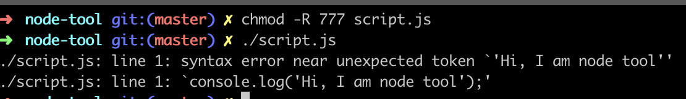
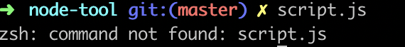

# 如何用node实现命令行工具

### 介绍概念
1. 脚本：假设我们创建了一个文件为script.js，这个文件称为脚本
2. 运行脚本：`node script.js`这个过程叫运行脚本

### 从运行脚本到命令行工具经过哪些步骤
1. 创建脚本
2. 设置脚本运行环境
3. 修改脚本权限
4. 设置环境变量
5. 运行脚本

### 一步一步实现一个命令行工具
1. node script.js 阶段
 - 新建一个文件夹 `mkdir node-tool`
 - `cd node-tool`
 - 新建一个文件，`touch script.js`, 内容`console.log('Hi, node tool');`
 - 命令行执行`node script.js`

 2. `./script.js` 阶段
 - 在命令行直接执行`./script.js`会提示`permission denied: ./script.js`，这是因为我们没有执行权限，解决办法
 `chmod -R 777 script.js`
 - 继续执行`./script.js`，报错如下
 
 这是因为脚本默认的执行环境是shell，shell里没有`console.log`，需要我们指定脚本的执行环境，修改后的script.js
 ```javascript
 #!/usr/local/bin/node
 console.log('Hi, node tool');
 ```
 - 我们想直接在命令行运行script.js，这样看起来像一个完整的命令，执行后报错
 
 这里我们要清楚一点：可以直接在命令行里执行的命令是因为我们把它放在了/usr/local/bin/目录下，我们可以尝试手动复制script.js到bin下，执行script.js，可以正常执行，所以我们的思路就是想办法把script.js命令和环境变量管理起来，在命令行里面执行：`ln script.js /usr/local/bin/script`，这行命令是将script.js复制到bin下为script。
