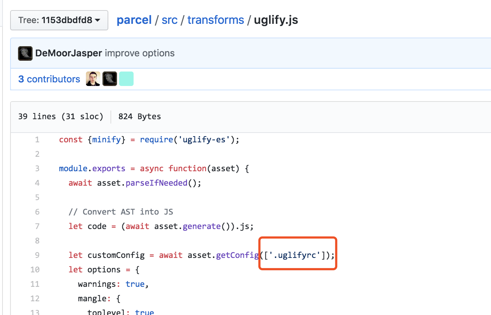

# 使用pacle build显示console.log内容

由于parcel使用的uglify，其默认情况会删除代码中的console.log代码。但在很多情况我们是希望我们打印的log要显示出来的（方便跟踪找线上bug^_^），我们可以使用修改配置来选择是否显示console.log

在工程的根目录下新建.uglifyrc文件，内容如下

```json
{
    "compress": {
       "drop_console": false
    }
}
```

当值为false时在parcel build后，日志就会显示出来了，反之亦然。

原文出自[Improve uglify options](https://github.com/parcel-bundler/parcel/pull/662/files/1153dbdfd86a303bd194d28e9c02357a79e7e92e)。

想要找出这么做的原因可以查看[源码](https://github.com/parcel-bundler/parcel/blob/1153dbdfd86a303bd194d28e9c02357a79e7e92e/src/transforms/uglify.js)，截图如下



