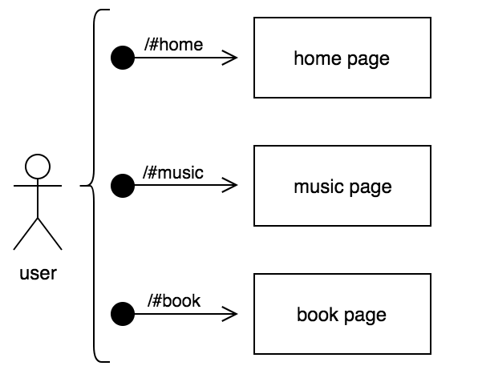
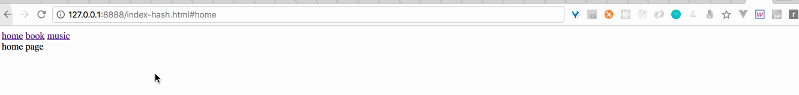

# 实现单页应用路由：hash



如上图所示当用户访问以#开头的不同路由时，浏览器会展示对应的页面内容。

### 原理

当使用hash来实现单页应用的路由，其中最关键的是路由（hash）的跳转会触发window自带的hashchange事件

```javascript
window.addEventListener('hashchange', function(){
    // 显示对应路由的页面
})
```

### 实现

```html
<div id="app">
    <div class="menu">
        <a href="#home">home</a>
        <a href="#book">book</a>
        <a href="#music">music</a>
    </div>
    <div class="view"></div>
</div>
```

点击menu中的任意选项，在view中出现对应的内容

```javascript
var view = document.querySelector('.view');
function hashView() {
    switch (window.location.hash) {
        case '#home':
            view.innerHTML = 'home page';
            break;
        case '#book':
            view.innerHTML = 'book page';
            break;
        case '#music':
            view.innerHTML = 'music page';
            break;
        default:
            view.innerHTML = '404 page';
    }
}
hashView();
window.addEventListener('hashchange', function(){
    hashView();
})
```

[点击这里查看源码](https://github.com/vmo-fed/spa-router/blob/master/index-hash.html)

### 使用

```shell
npm i http-server -g # 如已安装请忽略
git clone https://github.com/vmo-fed/spa-router.git
cd spa-router
http-server -p 8888
```

访问[http://127.0.0.1:8888/index-hash.html#home](http://127.0.0.1:8888/index-hash.html#home)

### 最终效果

