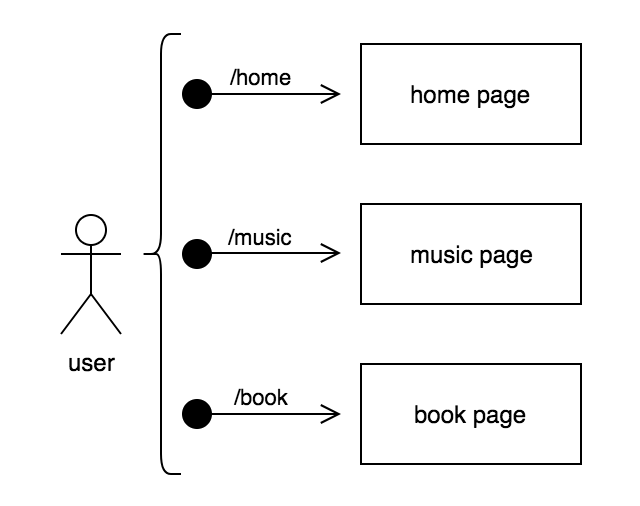
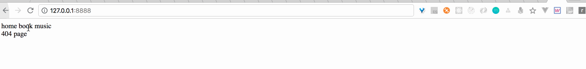

# 实现单页应用路由：history

> 从表面上看：hash访问需要带#，而history则不需要
>
> 从实现机制上看：hash的变化会触发window自带的hashchange事件，而history中pushState则不会触发window自带的任何事件，如popstate



如上图所示，用户访问不同路由时，浏览器会显示对应的页面内容。

### 原理

由于使用history的pushState方法并不会触发window自带的事件，需要我们自己去手动触发，这里可以采用订阅发布者模式

```javascript
var pushStateEvent = new Event('pushState');
window.addEventListener('pushState', function(){
    // 显示对应路由的页面
}, false)
// 在用户点击菜单进行跳转时去触发
window.dispatchEvent(pushStateEvent);
```

### 实现

```html
<div id="app">
    <div class="menu">
        <a link="/home">home</a>
        <a link="/book">book</a>
        <a link="/music">music</a>
    </div>
    <div class="view"></div>
</div>
```

点击menu中的任意选项，在view中出现对应的内容（这里并没有使用a的默认属性href，因为会触发浏览器跳转）

```javascript
var pushStateEvent = new Event('pushState');
var view = document.querySelector('.view');
stateView();
function stateView() {
    switch (window.location.pathname) {
        case '/home':
            view.innerHTML = 'home page';
            break;
        case '/book':
            view.innerHTML = 'book page';
            break;
        case '/music':
            view.innerHTML = 'music page';
            break;
        default:
            view.innerHTML = '404 page';
    }
}
window.addEventListener('pushState', function(){
    stateView()
}, false)
document.querySelectorAll('a').forEach(function(link){
    link.addEventListener('click', function(e){
        e.preventDefault();
        window.history.pushState(null, null, this.getAttribute('link'))
        window.dispatchEvent(pushStateEvent);
    })
})
```

[点击这里查看源码](https://github.com/vmo-fed/spa-router/blob/master/index-history.html)

### 使用

```shell
git clone https://github.com/vmo-fed/spa-router.git
cd spa-router
```

当我们使用http-sever来启动服务器，访问如/home页面刷新会提示找不到，这是因为http-server会根据路由去找对应的文件，然后返回其html内容，而单页应用只有一个页面，所以只要永远返回首页的内容就好了，这里可以简单实现下单页应用的server端

```javascript
// app.js
var http = require('http');
var fs = require('fs');
var indexPage = fs.readFileSync(__dirname + '/index-history.html');

http.createServer(function (request, response) {
    response.writeHeader(200, {"Content-Type": "text/html"});
    response.write(indexPage);
    response.end();
}).listen(8888);
```

启动server

```shell
node app.js
```

访问[http://127.0.0.1:8888/](http://127.0.0.1:8888/)

### 最终效果

